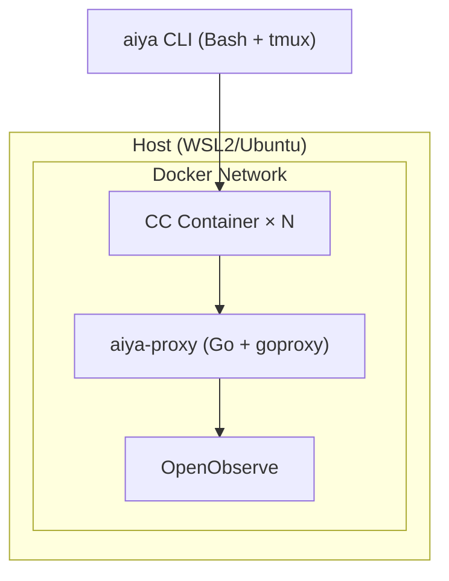

# AIYA

> Agents In Your Area — a framework that scales an expert's judgment

Change by an order of magnitude the value a single expert can produce.

AI agents have become "usable", but not yet "delegable". AIYA is a framework that structurally embeds an expert's unwavering judgment into their collaboration with AI, freeing them from babysitting and making success reproducible.

## Who is this for

Skilled developers.

People who already use AI agents heavily — who have tried spec-driven development, Plan Mode, skills, and parallel execution piece by piece — and who still hit a wall.

This is not a tool to level up juniors. It is a tool that unlocks scaling for people who can already make the right call.

## Problem

Core pain: **an expert's unwavering judgment is not being put to use in AI collaboration.**

What makes an expert an expert is not wavering: not losing sight of the goal, having a stable decision axis, not being blown around by tech trends. But in AI collaboration, there is no mechanism to put that steadiness to work.

### Babysitting never ends

As of 2026, spec-driven development is starting to spread. Write the spec first, plan before implementation. Experts are trying it.

AI still drifts mid-implementation. There is no mechanism to detect the widening distance between the spec and the output, so the expert ends up constantly asking "is this still okay?" More tools, more methods — and yet babysitting has only changed shape, not disappeared.

### Success isn't reproducible

Spec-driven, planning first, skills — each practice exists. On good days, the results are dramatic. But you cannot tell why it worked, so the next day you cannot reproduce it. There is no consistent process that explains the gap between success and failure.

## What you get

An expert's unwavering judgment becomes structurally part of the AI's work process.

**No babysitting** — instead of babysitting, you can focus on making the right call at the right moment. The Traceability Chain detects drift, and gates place expert judgment exactly when it is needed. Success stops being a personal hunch and becomes a reproducible process.

**Scale as one** — the value one expert can produce changes by an order of magnitude. AI does the work; the expert focuses on "what to build" and "did we get closer to the goal". Because the phases are clearly demarcated, multiple workers can be reviewed asynchronously.

For deeper background — prior art, scope, comparisons with existing tools, and FAQ — see [Background](docs/background.md).

## Concepts

AIYA stands on two orthogonal mechanisms. One guards **purpose**; the other guards **context**.

### Traceability Chain × Gates — guards purpose

An 8-element chain from user situation to execution, with expert-judged gates between phases. Drift becomes structurally detectable. See [Traceability Chain × Gates](docs/tc-x-gates.md).

### ACC (Agent Cognitive Compressor) — guards context

A generic runtime that suppresses context bloat and drift by handing a bounded state (CCS) between Turns — replacement semantics, not accumulation. See [ACC](docs/acc.md).

## Quickstart

<!-- TODO: Install steps and a minimal run example -->

```
# TODO
```

## Packages

- [**aiya-pit**](docs/aiya-pit.md) — sandbox (Dockerfile, CA cert, network restrictions)
- [**aiya-tape**](docs/aiya-tape.md) — audit proxy (Go + OpenObserve)
- [**aiya-jam**](docs/aiya-jam.md) — task management (SKILL.md, workflow definitions)
- **aiya** — full AIYA experience (CLI + docker-compose, integrates the three above)

pit (mosh pit), tape (recording tape), jam (jam session). All one-syllable, all music.

## Architecture



**aiya-proxy responsibilities:**
- API gateway
- HTTPS MITM
- Domain allow/deny
- Masking

**OpenObserve responsibilities:**
- Log storage
- Dashboards
- Built-in MCP
- SQL queries

## Security

Two layers: **early detection** + **runtime enforcement**.

**Layer 1: PreToolUse Hooks (early detection)**

Claude Code's hook mechanism. Rules are evaluated before tool execution and suspicious operations are flagged. Detection only; bypassable.

**Layer 2: Docker + Proxy (runtime enforcement)**

This is where actual restrictions are enforced.

Filesystem restrictions (Docker):
- Only the working directory is mounted (bind mount)
- The host filesystem is inaccessible

Network restrictions (Docker network):
- Docker's `internal` network setting physically cuts off the CC container from external access
- The CC container can only reach aiya-proxy
- Only aiya-proxy attaches to the external network, and it controls outbound traffic via an allowlist

## Contributing

<!-- TODO: Contribution guide, branch strategy, commit rules -->

TODO
