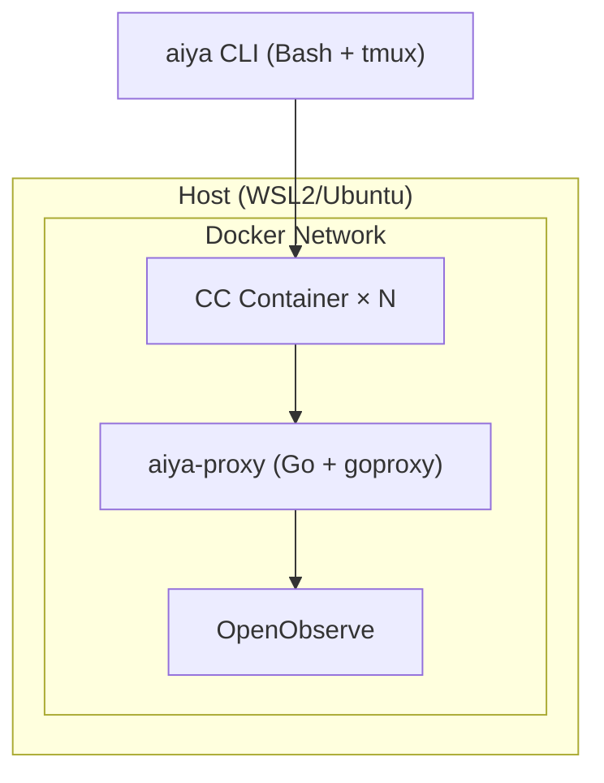

# AIYA

> Agents In Your Area — a framework that scales an expert's judgment

AIYA is a framework that structurally embeds an expert's unwavering judgment into their collaboration with AI. AI agents have become "usable" — but not yet "delegable". AIYA closes that gap.

Skilled developers have tried spec-driven development, Plan Mode, skills, and parallel execution piece by piece, yet still can't simultaneously achieve "freedom from babysitting" and "reproducible success" when working with AI. AIYA attacks that wall structurally. See [docs/vision.md](docs/vision.md) for the full picture.

## Core concepts

| Concept | One-liner | Details |
|---|---|---|
| **Traceability Chain** | Chains `Situation → Pain → Benefit → Acceptance Scenarios → Approach → Steps` so that drift is detectable | [docs/traceability-chain.md](docs/traceability-chain.md) |
| **CCS (Compressed Cognitive State)** | A bounded state representation that hands off between Steps with replacement semantics | [docs/ccs.md](docs/ccs.md) |
| **Gates** | Three-stage gates that insert expert judgment at each phase boundary | [docs/traceability-chain.md](docs/traceability-chain.md) / [docs/architecture.md](docs/architecture.md) |

## Quickstart

<!-- TODO: Install steps and a minimal run example -->

```
# TODO
```

## Documentation index

**Read first (for everyone)**
- [docs/vision.md](docs/vision.md) — why we build this
- [docs/traceability-chain.md](docs/traceability-chain.md) — what the Traceability Chain is
- [docs/ccs.md](docs/ccs.md) — Compressed Cognitive State
- [docs/architecture.md](docs/architecture.md) — overall architecture and work units

**For users**
- [docs/aiya-jam.md](docs/aiya-jam.md) — task management (SKILL.md, workflows)
- [docs/aiya-pit.md](docs/aiya-pit.md) — sandbox
- [docs/aiya-tape.md](docs/aiya-tape.md) — auditing and visualization

## Monorepo layout

| Package | Idea | Contents | Docs |
|---|---|---|---|
| **aiya** | Full AIYA experience (integration) | CLI + docker-compose | — |
| **aiya-pit** | Go wild in here (sandbox) | Dockerfile, CA certificate, network restrictions | [docs/aiya-pit.md](docs/aiya-pit.md) |
| **aiya-tape** | The tape is rolling (audit) | Go proxy, OpenObserve setup | [docs/aiya-tape.md](docs/aiya-tape.md) |
| **aiya-jam** | Let's jam (task management) | SKILL.md, workflow definitions | [docs/aiya-jam.md](docs/aiya-jam.md) |

pit (mosh pit), tape (recording tape), jam (jam session). All one-syllable, all music.

## System architecture



**aiya-proxy responsibilities:**
- API gateway
- HTTPS MITM
- Domain allow/deny
- Masking

**OpenObserve responsibilities:**
- Log storage
- Dashboards
- Built-in MCP
- SQL queries

## Security model

Two layers: **early detection** + **runtime enforcement**.

**Layer 1: PreToolUse Hooks (early detection)**

Claude Code's hook mechanism. Rules are evaluated before tool execution and suspicious operations are flagged. Detection only; bypassable.

**Layer 2: Docker + Proxy (runtime enforcement)**

This is where actual restrictions are enforced.

Filesystem restrictions (Docker):
- Only the working directory is mounted (bind mount)
- The host filesystem is inaccessible

Network restrictions (Docker network):
- Docker's `internal` network setting physically cuts off the CC container from external access
- The CC container can only reach aiya-proxy
- Only aiya-proxy attaches to the external network, and it controls outbound traffic via an allowlist

## Contributing

<!-- TODO: Contribution guide, branch strategy, commit rules -->

TODO
