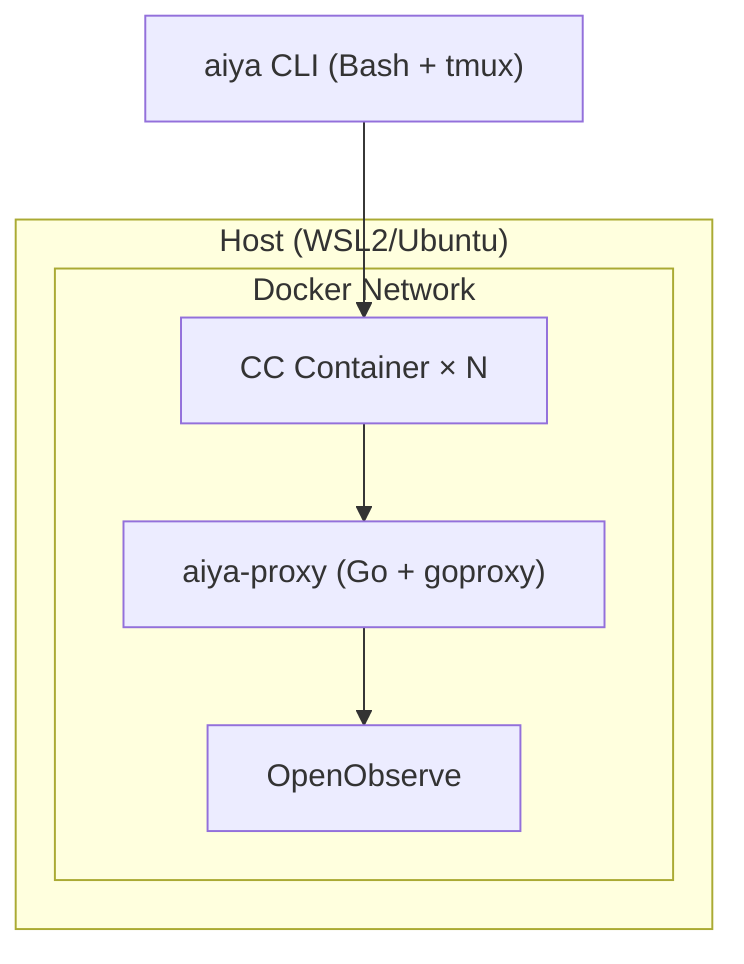

# AIYA

> Agents In Your Area — エキスパートの判断力をスケールさせるフレームワーク

<!-- TODO(translation): このREADMEは最終的に英語化する。見出しは英語、本文は現状日本語。 -->

AIYAは、エキスパートの「ブレない判断力」をAIとの協働プロセスに構造的に組み込むフレームワーク。AIエージェントは「使える」ようになったが「任せられる」ようにはなっていない。AIYAはその溝を埋める。

技量のある開発者が仕様駆動開発、Plan Mode、スキル活用、並列実行を個別に試しても、AIとの協働における「子守りからの解放」と「成功の再現」を同時に実現できていない。AIYAはこの壁を構造的に解く。詳細は [docs/vision.md](docs/vision.md) を参照。

## Core concepts

| 概念 | 一行説明 | 詳細 |
|---|---|---|
| **Traceability Chain** | `Situation → Pain → Benefit → Acceptance Scenarios → Approach → Steps` を連鎖させてドリフトを検知する | [docs/traceability-chain.md](docs/traceability-chain.md) |
| **CCS (Compressed Cognitive State)** | Step間の引き継ぎを置換セマンティクスで管理する有界な状態表現 | [docs/ccs.md](docs/ccs.md) |
| **Gates** | 各フェーズ境界でエキスパートの判断を介在させる三段階ゲート | [docs/traceability-chain.md](docs/traceability-chain.md) / [docs/architecture.md](docs/architecture.md) |

## Quickstart

<!-- TODO: インストール手順、最小の実行例 -->

```
# TODO
```

## Documentation index

**まず読む（全員向け）**
- [docs/vision.md](docs/vision.md) — なぜ作るか
- [docs/traceability-chain.md](docs/traceability-chain.md) — トレーサビリティチェインとは
- [docs/ccs.md](docs/ccs.md) — Compressed Cognitive State
- [docs/architecture.md](docs/architecture.md) — 全体アーキテクチャと作業単位

**使う人向け**
- [docs/aiya-jam.md](docs/aiya-jam.md) — タスク管理（SKILL.md、ワークフロー）
- [docs/aiya-pit.md](docs/aiya-pit.md) — サンドボックス
- [docs/aiya-tape.md](docs/aiya-tape.md) — 監査・可視化

## Monorepo layout

| パッケージ | 思想 | 中身 | ドキュメント |
|---|---|---|---|
| **aiya** | AIYAフル体験（統合） | CLI + docker-compose | — |
| **aiya-pit** | ここで暴れろ（サンドボックス） | Dockerfile, CA証明書, ネットワーク制限 | [docs/aiya-pit.md](docs/aiya-pit.md) |
| **aiya-tape** | テープ回してるぞ（監査） | Goプロキシ, OpenObserve構成 | [docs/aiya-tape.md](docs/aiya-tape.md) |
| **aiya-jam** | 一緒にやろう（タスク管理） | SKILL.md, ワークフロー定義 | [docs/aiya-jam.md](docs/aiya-jam.md) |

pit（モッシュピット）、tape（録音テープ）、jam（ジャムセッション）。全部1音節、全部音楽。

## System architecture



**aiya-proxy の責務:**
- APIゲートウェイ
- HTTPS MITM
- ドメイン許可/拒否
- マスキング

**OpenObserve の責務:**
- ログストレージ
- ダッシュボード
- 内蔵MCP
- SQLクエリ

## Security model

2層構造: **早期検知** + **実行時制御**

**Layer 1: PreToolUse Hooks（早期検知）**

Claude Codeのフック機構。ツール実行前にルールを評価し、不審な操作を検知・警告する。検知のみで、バイパス可能。

**Layer 2: Docker + Proxy（実行時制御）**

実際の制限はここで担保する。

ファイルアクセス制限（Docker）:
- 作業ディレクトリのみマウント（bind mount）
- ホストのファイルシステムにアクセス不可

ネットワーク制限（Docker network）:
- Docker networkの `internal` 設定でCCコンテナの外部アクセスを物理的に遮断
- CCコンテナからはaiya-proxyにしか到達できない構成
- aiya-proxyだけが外部ネットワークに接続し、ドメイン許可リストで制御

## Contributing

<!-- TODO: コントリビュートガイド、ブランチ戦略、コミットルール -->

TODO
