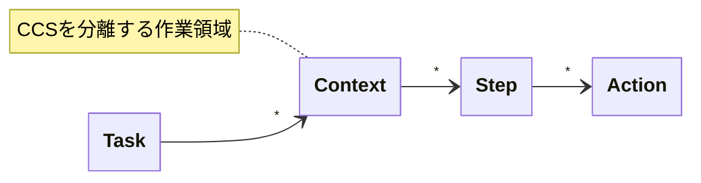

# ACCベースのエージェントアーキテクチャ

## 概要

本ドキュメントは、論文「AI Agents Need Memory Control Over More Context」（Bousetouane, 2026）で提案されたAgent Cognitive Compressor（ACC）の考え方を基に、Claude Codeのエージェントスキルに適用するためのアーキテクチャ設計をまとめたものです。

## 背景：なぜACCが必要か

### 従来のアプローチの問題

| アプローチ | 問題点 |
|---|---|
| Transcript Replay | Contextが線形に増大し、初期のミスが繰り返し参照され、ドリフト・ハルシネーションが蓄積します |
| Retrieval-based Memory | 意味的類似性で検索するため、Task制御に必要な情報と一致しません。古い・矛盾した情報が混入しやすくなります |

### ACCの解決策

- **有界な状態管理**：蓄積ではなく置換します
- **Schemaによる構造化**：何を保持すべきか明確に定義します
- **Artifact参照とState Commitの分離**：検索は候補提案のみで、実際の状態更新はSchemaに従って厳密に制御します

---

## CCS（Compressed Cognitive State）

### 形式定義

CCSは以下の形式で記述します。

```
component_name:
  type(contents)
  type(contents)
  ...
```

| 要素 | 説明 |
|---|---|
| component_name | CCSを構成する9つの要素です（後述） |
| type | Component毎に定義された述語や型です |
| contents | 具体的な値や内容です（自由記述） |

この形式は論文で「TOON style token-oriented representation」と呼ばれています。JSONやYAMLより軽量で、トークン効率を重視しています。

### type定義の考え方

typeはComponent毎に「何を表すか」を定義します。

| ポイント | 説明 |
|---|---|
| typeを限定する | 記述が安定し、エージェントが迷わず書けます |
| 読み手も予測しやすい | typeが決まっていれば解釈が一貫します |
| contentsは自由記述 | 具体的な内容はサンプルで示します |
| 語彙は固定ではない | 実際に使いながら調整します |

### Component一覧とtype定義

| Component | 役割 | typeの定義 | typeサンプル（論文＋拡張） |
|---|---|---|---|
| episodic_trace | 直前のStepで何が起きたか | 動作の種類 | observed, executed, received, completed, failed, logged, constraint |
| semantic_gist | 本質的に何をしているか | 作業の目的 | implement, fix, investigate, refactor, migrate, diagnose, mitigate |
| focal_entities | 何を扱っているか | 対象物の種類 | file, function, class, interface, service, api, table, host, feature, signal |
| relational_map | それらはどう関係するか | 関係の種類 | depends, calls, implements, extends, before, after, timing, possible |
| goal_orientation | 最終ゴールは何か | 達成の種類 | achieve, ensure, complete, deliver, verify, reduce, preserve |
| constraints | 何をしてはいけないか | 制約の種類 | must, must_not, prefer, avoid, follow, no_restart, reload_allowed, safe_change |
| predictive_cue | 次に何をすべきか | 次の行動の種類 | next, verify, generate, check, test, review, validate |
| uncertainty_signal | 何がまだ不確かか | 不確実性の種類 | level, gap, assumption, pending, unverified |
| retrieved_artifacts | どこから情報を得たか | 参照物の種類 | doc, code, log, config, spec, guide, snippet |

### CCSサンプル（IT運用Task：論文より）

```
episodic_trace:
  observed(502 spikes after(enable(http2)))
  logged(nginx error upstream closed early)
  constraint(no restart during(business hours))

semantic_gist:
  mitigate(502) & diagnose(upstream instability)

focal_entities:
  host(vm ubuntu22 04)
  service(nginx)
  service(node upstream)
  feature(http2)
  signal(error 502)

relational_map:
  timing(502 spikes after(http2 enable))
  possible(upstream timeout 502)
  possible(upstream connection close 502)

goal_orientation:
  reduce(502 rate within(10min)) & preserve(service availability)

constraints:
  no_restart(nginx)
  reload_allowed(nginx)
  safe_change(minimal)
  avoid(speculation)

predictive_cue:
  check(upstream latency)
  check(node memory growth)
  validate(nginx timeouts)

uncertainty_signal:
  level(medium)
  gap(root cause not confirmed)

retrieved_artifacts:
  snippet(nginx error upstream prematurely closed)
  doc(recent change enable http2)
  doc(constraint note no restart)
```

### CCSサンプル（開発Task）

```
episodic_trace:
  completed(design review)
  received(approval from tech lead)
  failed(first test run due to missing mock)

semantic_gist:
  implement(user authentication module)

focal_entities:
  file(src/auth/login.ts)
  function(validateCredentials)
  function(generateToken)
  function(refreshToken)
  interface(UserCredentials)
  interface(AuthToken)

relational_map:
  calls(login -> validateCredentials)
  depends(validateCredentials -> bcrypt)
  implements(LoginService -> IAuthService)

goal_orientation:
  achieve(auth module implementation)
  ensure(test coverage 80%+)

constraints:
  must(use bcrypt for password hashing)
  must_not(store plain text password)
  follow(project coding standards)
  avoid(external api call in unit test)

predictive_cue:
  next(generate test cases for validateCredentials)
  verify(token expiry handling)

uncertainty_signal:
  level(low)
  gap(token expiry time not specified in design)

retrieved_artifacts:
  spec(auth-module-spec.md)
  guide(CODING_STANDARDS.md)
```

### CCS管理の原則

| 原則 | 説明 |
|---|---|
| 1ファイル1Task | TaskごとにCCSファイルを1つ作成します |
| Step毎に新規作成 | 蓄積ではなく、最新状態を新規作成します（置換セマンティクス） |
| コンテキスト非共有 | Task AgentとStep Agentはコンテキストを共有しません |
| CCSが唯一の橋渡し | Step間の引き継ぎはCCSのみです |

### CCSサイズの健全性

CCSが肥大化する場合は、Step設計を見直します。CCSのサイズは「Step設計の健全性指標」になります。

| 症状 | 原因 | 対処 |
|---|---|---|
| focal_entitiesが多すぎる | Stepの責務が広すぎます | Stepを分割します |
| relational_mapが複雑 | 一度に扱う関係が多すぎます | スコープを絞ります |
| uncertainty_signalが多い | 未確定のまま進みすぎています | 確定させるStepを挟みます |

---

## エージェントアーキテクチャ

### 作業単位

本アーキテクチャは以下の作業単位を前提とします。



| Level | 用語 | 説明 |
|---|---|---|
| 1 | Task | 達成すべきゴール |
| 2 | Context | CCSを分離する作業領域。例：Planning / Implementation |
| 3 | Step | Contextを構成する作業フロー |
| 4 | Action | Stepを構成する具体的な操作 |

### 全体構成

```
┌─────────────────────────────────────────────────────────┐
│                    Task Agent                           │
│                   （実作業禁止）                          │
├─────────────────────────────────────────────────────────┤
│  Planning Context                                       │
│  ├── Step 1: Step Agent                                │
│  │     └── CCS_P0 → Action → CCS_P1                   │
│  ├── Step N: Step Agent                                │
│  │     └── CCS_P{N-1} → Action → CCS_PN              │
│  └── Output: Implementation Steps + CCS_I0             │
├─────────────────────────────────────────────────────────┤
│  Implementation Context                                 │
│  ├── Step 1: Step Agent                                │
│  │     └── CCS_I0 → Action → CCS_I1                   │
│  ├── Step N: Step Agent                                │
│  │     └── CCS_I{N-1} → Action → CCS_IN              │
│  └── 完了判定・品質チェック                               │
└─────────────────────────────────────────────────────────┘
```

### Task Agentの役割

**重要：Task Agentは実作業を行いません**

この制約は、全体計画の品質を維持するために不可欠です。実作業を許可すると、計画品質が劣化することが実践で確認されています。

| 責務 | 説明 |
|---|---|
| Task全体の進行管理 | Planning ContextとImplementation Contextを制御します |
| Stepの管理 | どのStepをどの順序で実行するかを決めます |
| Step Agentへの委譲 | 各Stepの実行を適切なStep Agentに委譲します |
| 完了判定 | 各Stepおよび全体の完了を判定します |
| CCSの妥当性チェック | 必要に応じてCCSの内容を検証します |

### Planning Context

```
各Step:
  Input:
    - CCS_P{N-1}
    - Stepの作業指示

  Step Agent:
    - CCS_P{N-1}を読み込み（唯一の引き継ぎ情報）
    - CCS_P{N-1}から必要な情報を参照
    - Action実行
    - CCS_PNを新規作成

  Output:
    - CCS_PN

最終Output:
  - Implementation Steps
  - CCS_I0
```

### Implementation Context

```
各Step:
  Input:
    - CCS_I{N-1}
    - Stepの作業指示（Implementation Stepsより）

  Step Agent:
    - CCS_I{N-1}を読み込み（唯一の引き継ぎ情報）
    - CCS_I{N-1}から必要な情報・成果物を参照
    - Action実行
    - CCS_INを新規作成
    - 成果物・情報をCCS_INに記録

  Output:
    - CCS_IN
    - 成果物（コード、テストなど）
```

---

## 具体例：テストコード・プロダクションコード生成

```
Task: 認証モジュールの実装
│
├── Planning Context
│     ├── Step 1: インプット情報を収集・分析
│     │     ├── Action: 設計ドキュメントを検索・取得
│     │     ├── Action: 開発ガイドを検索・取得
│     │     └── Action: 関連する既存コードを調査
│     │     CCS_P0 → CCS_P1
│     │
│     ├── Step 2: Implementation Stepsを設計
│     │     Action: 実装対象の特定、Step分解、作業指示作成
│     │     CCS_P1 → CCS_P2
│     │
│     └── Output: Implementation Steps + CCS_I0
│
└── Implementation Context
      ├── Step 1: テストケースを設計
      │     ├── Action: 正常系のテストケースを洗い出す
      │     ├── Action: 異常系のテストケースを洗い出す
      │     └── Action: テストケース一覧を作成
      │     CCS_I0 → CCS_I1
      │
      ├── Step 2: テストコードを生成
      │     Action: テストケースに基づきテストコードを実装
      │     CCS_I1 → CCS_I2
      │
      ├── Step 3: テストデータを生成
      │     Action: テストケースに必要なテストデータを作成
      │     CCS_I2 → CCS_I3
      │
      ├── Step 4: プロダクションコードを生成
      │     Action: テストが通るようにプロダクションコードを実装
      │     CCS_I3 → CCS_I4
      │
      └── Step 5: テスト実行・修正
            Action: テスト実行、失敗時は修正
            CCS_I4 → CCS_I5
```

---

## 論文の評価結果

ACC論文では、50ターンのマルチターン評価で以下の結果が得られています。

### メモリ使用量

- **Baseline（Transcript Replay）**：ターン数に比例して線形増加します
- **Retrieval（Retrieval-based）**：一定ですが、検索エラーによるドリフトがあります
- **ACC**：一定かつドリフトがありません

### Task品質

| 指標 | Baseline | Retrieval | ACC |
|---|---|---|---|
| Relevance | 中 | 中 | 高 |
| Answer Quality | 中 | 中 | 高 |
| Instruction Following | 低 | 中 | 高 |
| Coherence | 低 | 中 | 高 |

### ハルシネーション率・ドリフト率

- **Baseline**：ターン数増加とともに上昇します
- **Retrieval**：変動が大きいです
- **ACC**：ほぼゼロで安定しています

---

## 参考文献

- Bousetouane, F. (2026). AI Agents Need Memory Control Over More Context. arXiv:2601.11653v1

---

## 変更履歴

| 日付 | 内容 |
|---|---|
| 2025-01-25 | 初版作成 |
