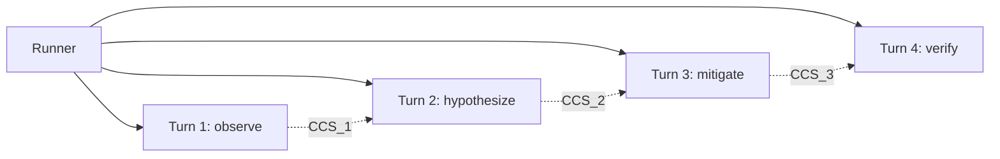

# ACC (Agent Cognitive Compressor)

> A generic mechanism to suppress context bloat and drift across multi-turn AI agents

ACC is a runtime pattern for AI agents that run across many Turns. Instead of replaying the transcript, each Turn reconstructs a bounded state — **CCS (Compressed Cognitive State)** — and hands it to the next Turn. Context stops growing linearly, and early mistakes stop getting replayed.

Both terms (ACC and CCS) come from the paper *AI Agents Need Memory Control Over More Context* (Bousetouane, 2026). ACC itself has no dependency on AIYA; it is a generic pattern that can sit under any multi-turn agent pipeline. AIYA adopts it as its runtime.

## Why

Traditional context management suffers from two problems:

| Approach | Problem |
|---|---|
| Transcript Replay | Context grows linearly; early mistakes are replayed, accumulating drift and hallucinations |
| Retrieval-based Memory | Semantic-similarity search does not match what task control actually needs; stale or contradictory information leaks in |

ACC's answer:

- **Bounded state management** — replace, do not accumulate
- **Structure via schema** — state explicitly what must be kept
- **Separate artifact references from state commits** — retrieval only proposes candidates; actual state updates are strictly schema-controlled

## Actors

ACC has three actors.

| Actor | Role |
|---|---|
| **Runner** | Orchestrates a sequence of Turns. Decides what runs next and delegates execution. Does not do the work itself. |
| **Turn (AI)** | One AI invocation. Consumes `CCS_{N-1}` and Turn instructions, performs the work, and produces `CCS_N`. Turns do not share conversation context with each other. |
| **CCS** | The bounded state handed between Turns. The only bridge. |

## Turn I/O

Every Turn follows the same input/output contract.

```
Each Turn:
  Input:
    - CCS_{N-1}
    - Turn instructions

  AI:
    - Load CCS_{N-1} (the only handoff)
    - Pull what it needs from CCS_{N-1}
    - Run the work
    - Produce a fresh CCS_N
    - Record artifacts and information in CCS_N

  Output:
    - CCS_N
    - Artifacts (code, findings, logs, etc.)
```

Because each Turn reconstructs CCS fresh, context does not accumulate across Turns — the replacement semantics are what make ACC bounded.

## CCS

### The 9 components

| Component | Role |
|---|---|
| episodic_trace | What just happened in the previous Turn |
| semantic_gist | What we are fundamentally doing |
| focal_entities | What we are working on |
| relational_map | How they relate to each other |
| goal_orientation | What the end goal is |
| constraints | What must not be done |
| predictive_cue | What to do next |
| uncertainty_signal | What is still uncertain |
| retrieved_artifacts | Where information came from |

### Format

CCS is written in the form:

```
component_name:
  type(contents)
  type(contents)
  ...
```

| Part | Description |
|---|---|
| component_name | One of the nine CCS components |
| type | A predicate or type defined per component |
| contents | The concrete value or content (free-form) |

The paper calls this a "TOON style token-oriented representation". It is lighter than JSON or YAML and optimized for token efficiency.

### Type vocabulary

`type` defines "what this represents" per component.

| Principle | Description |
|---|---|
| Constrain types | Writing stays stable; the agent never hesitates |
| Predictable for readers | Fixed types yield consistent interpretation |
| Contents are free-form | Show the concrete shape via samples |
| Vocabulary is not frozen | Adjust as it gets used in practice |

| Component | What `type` means | Sample types (paper + extensions) |
|---|---|---|
| episodic_trace | Kind of action | observed, executed, received, completed, failed, logged, constraint |
| semantic_gist | Purpose of the work | implement, fix, investigate, refactor, migrate, diagnose, mitigate |
| focal_entities | Kind of target | file, function, class, interface, service, api, table, host, feature, signal |
| relational_map | Kind of relationship | depends, calls, implements, extends, before, after, timing, possible |
| goal_orientation | Kind of outcome | achieve, ensure, complete, deliver, verify, reduce, preserve |
| constraints | Kind of constraint | must, must_not, prefer, avoid, follow, no_restart, reload_allowed, safe_change |
| predictive_cue | Kind of next action | next, verify, generate, check, test, review, validate |
| uncertainty_signal | Kind of uncertainty | level, gap, assumption, pending, unverified |
| retrieved_artifacts | Kind of reference | doc, code, log, config, spec, guide, snippet |

### Management principles

| Principle | Description |
|---|---|
| One file per run | Create exactly one CCS file per Runner invocation |
| New file per Turn | Do not accumulate; always create the latest state fresh (replacement semantics) |
| No shared context | Runner and Turn do not share conversation context |
| CCS is the only bridge | The only handoff between Turns is the CCS |

### Size health

When a CCS starts to bloat, revisit Turn design. CCS size is a **health indicator for Turn design**.

| Symptom | Cause | Remedy |
|---|---|---|
| Too many focal_entities | The Turn's scope is too broad | Split the Turn |
| relational_map is tangled | Too many relationships in one pass | Narrow the scope |
| Lots of uncertainty_signal | Too much was left unresolved | Insert a Turn whose job is to resolve it |

## Example: diagnose a production alert

A generic multi-Turn flow. No framework, no hierarchy — just Runner + Turns + CCS.



- **Turn 1 — observe**: collect recent logs and metrics. `CCS_0 → CCS_1`
- **Turn 2 — hypothesize**: form hypotheses on the root cause. `CCS_1 → CCS_2`
- **Turn 3 — mitigate**: apply a safe mitigation. `CCS_2 → CCS_3`
- **Turn 4 — verify**: confirm the symptom is resolved. `CCS_3 → CCS_4`

A CCS snapshot after Turn 2 might look like this:

```
episodic_trace:
  observed(502 spikes after(enable(http2)))
  logged(nginx error upstream closed early)
  constraint(no restart during(business hours))

semantic_gist:
  mitigate(502) & diagnose(upstream instability)

focal_entities:
  host(vm ubuntu22 04)
  service(nginx)
  service(node upstream)
  feature(http2)
  signal(error 502)

relational_map:
  timing(502 spikes after(http2 enable))
  possible(upstream timeout 502)
  possible(upstream connection close 502)

goal_orientation:
  reduce(502 rate within(10min)) & preserve(service availability)

constraints:
  no_restart(nginx)
  reload_allowed(nginx)
  safe_change(minimal)
  avoid(speculation)

predictive_cue:
  check(upstream latency)
  check(node memory growth)
  validate(nginx timeouts)

uncertainty_signal:
  level(medium)
  gap(root cause not confirmed)

retrieved_artifacts:
  snippet(nginx error upstream prematurely closed)
  doc(recent change enable http2)
  doc(constraint note no restart)
```

Turn 3 loads this CCS, picks a mitigation, applies it, and writes `CCS_3` with the outcome. No transcript is replayed; only the bounded CCS is passed.

## Paper evaluation

The ACC paper reports the following results over a 50-turn multi-turn evaluation.

**Memory usage**

- Baseline (Transcript Replay): grows linearly with turn count
- Retrieval (Retrieval-based): stays flat, but drifts due to search errors
- ACC: stays flat and does not drift

**Task quality**

| Metric | Baseline | Retrieval | ACC |
|---|---|---|---|
| Relevance | Med | Med | High |
| Answer Quality | Med | Med | High |
| Instruction Following | Low | Med | High |
| Coherence | Low | Med | High |

**Hallucination / drift rate**

- Baseline: rises with turn count
- Retrieval: highly variable
- ACC: near zero and stable

## Related documents

- [AIYA README](../README.md) — why AIYA exists
- [Traceability Chain × Steering Gates](tc-x-gates.md) — how AIYA drives Turns toward a goal
- [aiya-jam](aiya-jam.md) — the package that stores and hands off CCS files

## Open questions

- [ ] Physical location of CCS files
- [ ] CCS versioning (whether to keep the state before replacement)
- [ ] Extension policy for the type vocabulary
- [ ] Runner implementation form (subagent / separate session / separate container)
- [ ] Async coordination for parallel Turns

## References

- Bousetouane, F. (2026). *AI Agents Need Memory Control Over More Context*. arXiv:2601.11653v1
