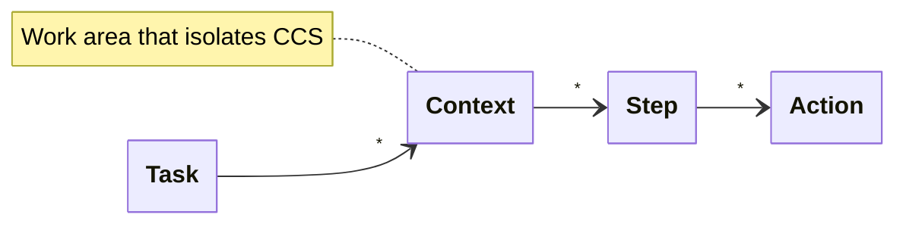
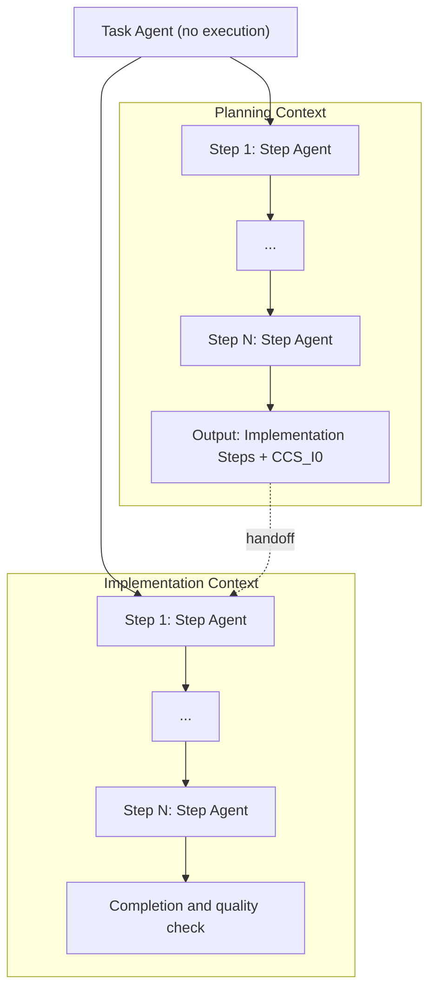
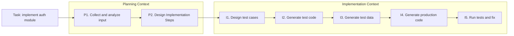

# Architecture

> AIYA's work-unit hierarchy and agent placement

This document defines the work units that drive a Traceability Chain and the responsibilities of the agents that run on top of them. CCS ([ccs.md](ccs.md)) is the Step-to-Step handoff within this structure.

## Work unit hierarchy



| Level | Term | Description |
|---|---|---|
| 1 | Task | The goal to achieve |
| 2 | Context | Work area that isolates CCS. Example: Planning / Implementation |
| 3 | Step | Work flow that makes up a Context |
| 4 | Action | Concrete operation that makes up a Step |

## Overall structure



## Task Agent

**Important: the Task Agent does not do the actual work.**

This constraint is essential for protecting plan quality. Allowing execution has been shown in practice to degrade planning.

| Responsibility | Description |
|---|---|
| Overall Task progress | Controls the Planning Context and the Implementation Context |
| Step management | Decides which Steps run in what order |
| Delegation to Step Agents | Delegates each Step's execution to the appropriate Step Agent |
| Completion judgment | Judges the completion of each Step and of the whole |
| CCS validation | Validates CCS content when needed |

## Planning Context

```
Each Step:
  Input:
    - CCS_P{N-1}
    - Step instructions

  Step Agent:
    - Load CCS_P{N-1} (the only handoff)
    - Pull what it needs from CCS_P{N-1}
    - Run Actions
    - Create a fresh CCS_PN

  Output:
    - CCS_PN

Final Output:
  - Implementation Steps
  - CCS_I0
```

## Implementation Context

```
Each Step:
  Input:
    - CCS_I{N-1}
    - Step instructions (from Implementation Steps)

  Step Agent:
    - Load CCS_I{N-1} (the only handoff)
    - Pull needed information and artifacts from CCS_I{N-1}
    - Run Actions
    - Create a fresh CCS_IN
    - Record artifacts and information in CCS_IN

  Output:
    - CCS_IN
    - Artifacts (code, tests, etc.)
```

## Example: implementation task

Using "implement the auth module" as an example, here is the Task/Context/Step flow. Per-Step Actions are omitted from the diagram to keep it readable and are listed in prose below.



**Actions and CCS transitions per Step:**

- **P1. Collect and analyze input** — search design docs, search developer guides, survey existing code / `CCS_P0 → CCS_P1`
- **P2. Design Implementation Steps** — identify target, decompose into Steps, write Step instructions / `CCS_P1 → CCS_P2`
- **I1. Design test cases** — enumerate happy-path and edge cases, produce the case list / `CCS_I0 → CCS_I1`
- **I2. Generate test code** — implement tests from the case list / `CCS_I1 → CCS_I2`
- **I3. Generate test data** — produce the test data each case needs / `CCS_I2 → CCS_I3`
- **I4. Generate production code** — implement production code that passes the tests / `CCS_I3 → CCS_I4`
- **I5. Run tests and fix** — execute tests, fix on failure / `CCS_I4 → CCS_I5`

## Gate placement

<!-- TODO: Where to place the three-stage gates across Task / Context / Step -->

**Open**: [vision.md](vision.md) / [traceability-chain.md](traceability-chain.md) refer to "three-stage gates", but their placement in this work-unit hierarchy is undefined.

Candidates:
- Put gates at Context boundaries (Planning → Implementation, Implementation → done)
- Gate 1 at Task start (Benefit commit)
- Gates 2/3 at Context boundaries

## Chain ↔ Task mapping

<!-- TODO: Define how Traceability Chain's 6 elements correspond to Task/Context/Step/Action -->

**Open**: the correspondence between the Chain (`Situation → Pain → Benefit → Acceptance Scenarios → Approach → Steps`) and Task/Context/Step/Action is undefined.

Working hypothesis:
- `Situation / Pain / Benefit / Acceptance Scenarios` → Task-level context
- `Approach` → basis for splitting into Contexts
- `Steps` → the Step sequence inside the Implementation Context (although the Chain's "Steps" and ACC's "Step" share the same word at different granularities)

**Naming collision warning**: the Chain's "Steps" and ACC's "Step" are not yet disambiguated. A rename or an explicit definition is needed.

## Related documents

- [vision.md](vision.md) — why this structure is necessary
- [traceability-chain.md](traceability-chain.md) — the Chain side of the spec
- [ccs.md](ccs.md) — Step-to-Step handoff representation
- [aiya-jam.md](aiya-jam.md) — the package that implements this structure

## Open questions

- [ ] Placement of the three-stage gates
- [ ] Exact correspondence between Chain and Task/Context/Step/Action
- [ ] Resolve the "Step" naming collision
- [ ] Implementation form of Task Agent / Step Agent (subagent / separate session / separate container)
- [ ] Async review scheme for parallel Step Agents
