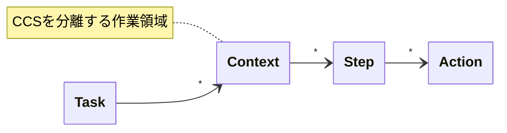
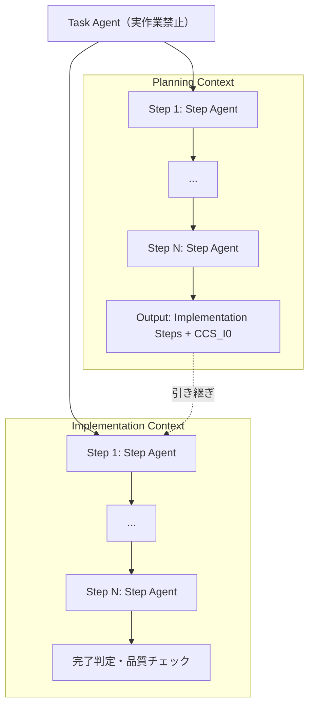
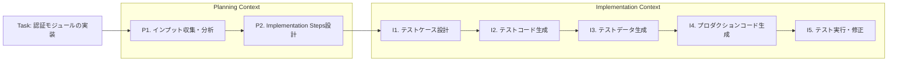

# Architecture

> AIYA 全体の作業単位とエージェント配置

<!-- TODO(translation): 本文を英語化する。 -->

Traceability Chain を駆動するための作業単位と、その上で動くエージェントの責務分担を定義する。CCS（[ccs.md](ccs.md)）はこの構造の中でStep間の引き継ぎを担う。

## Work unit hierarchy



| Level | 用語 | 説明 |
|---|---|---|
| 1 | Task | 達成すべきゴール |
| 2 | Context | CCSを分離する作業領域。例：Planning / Implementation |
| 3 | Step | Contextを構成する作業フロー |
| 4 | Action | Stepを構成する具体的な操作 |

## Overall structure



## Task Agent

**重要：Task Agentは実作業を行わない**

この制約は、全体計画の品質を維持するために不可欠。実作業を許可すると、計画品質が劣化することが実践で確認されている。

| 責務 | 説明 |
|---|---|
| Task全体の進行管理 | Planning ContextとImplementation Contextを制御する |
| Stepの管理 | どのStepをどの順序で実行するかを決める |
| Step Agentへの委譲 | 各Stepの実行を適切なStep Agentに委譲する |
| 完了判定 | 各Stepおよび全体の完了を判定する |
| CCSの妥当性チェック | 必要に応じてCCSの内容を検証する |

## Planning Context

```
各Step:
  Input:
    - CCS_P{N-1}
    - Stepの作業指示

  Step Agent:
    - CCS_P{N-1}を読み込み（唯一の引き継ぎ情報）
    - CCS_P{N-1}から必要な情報を参照
    - Action実行
    - CCS_PNを新規作成

  Output:
    - CCS_PN

最終Output:
  - Implementation Steps
  - CCS_I0
```

## Implementation Context

```
各Step:
  Input:
    - CCS_I{N-1}
    - Stepの作業指示（Implementation Stepsより）

  Step Agent:
    - CCS_I{N-1}を読み込み（唯一の引き継ぎ情報）
    - CCS_I{N-1}から必要な情報・成果物を参照
    - Action実行
    - CCS_INを新規作成
    - 成果物・情報をCCS_INに記録

  Output:
    - CCS_IN
    - 成果物（コード、テストなど）
```

## Example: implementation task

認証モジュール実装を例に Task/Context/Step の流れを示す。各Step内の具体的なActionは煩雑になるため図からは省略し、本文で補足する。



**Step毎のActionとCCS遷移:**

- **P1. インプット収集・分析** — 設計ドキュメント検索、開発ガイド検索、既存コード調査 / `CCS_P0 → CCS_P1`
- **P2. Implementation Steps設計** — 実装対象の特定、Step分解、作業指示作成 / `CCS_P1 → CCS_P2`
- **I1. テストケース設計** — 正常系・異常系の洗い出し、一覧作成 / `CCS_I0 → CCS_I1`
- **I2. テストコード生成** — テストケースに基づく実装 / `CCS_I1 → CCS_I2`
- **I3. テストデータ生成** — 必要なテストデータの作成 / `CCS_I2 → CCS_I3`
- **I4. プロダクションコード生成** — テストが通る実装 / `CCS_I3 → CCS_I4`
- **I5. テスト実行・修正** — テスト実行、失敗時は修正 / `CCS_I4 → CCS_I5`

## Gate placement

<!-- TODO: 三段階ゲートを Task / Context / Step のどこに配置するか -->

**未決**: [vision.md](vision.md) / [traceability-chain.md](traceability-chain.md) の「三段階ゲート」を、この作業単位階層のどこに配置するか未定義。

想定候補：
- Context境界にゲートを置く（Planning→Implementation、Implementation→完了）
- Task開始時にゲート1（Benefit確定）
- Context境界でゲート2/3

## Chain ↔ Task mapping

<!-- TODO: Traceability Chain の6要素と Task/Context/Step/Action の対応関係を定義 -->

**未決**: Chain（`Situation → Pain → Benefit → Acceptance Scenarios → Approach → Steps`）と Task/Context/Step/Action の対応が未定義。

想定：
- `Situation / Pain / Benefit / Acceptance Scenarios` → Task 全体の文脈
- `Approach` → Context 分割の根拠
- `Steps` → Implementation Context の Step 列（ただし Chain側の "Steps" と ACC側の "Step" で同じ語だが粒度が違う可能性）

**用語衝突注意**: Chain の "Steps" と ACC の "Step" は現状区別されていない。リネームまたは明示的な定義が必要。

## Related documents

- [vision.md](vision.md) — なぜこの構造が必要か
- [traceability-chain.md](traceability-chain.md) — Chain側の仕様
- [ccs.md](ccs.md) — Step間の引き継ぎ表現
- [aiya-jam.md](aiya-jam.md) — この構造を実装するパッケージ

## Open questions

- [ ] 三段階ゲートの配置
- [ ] Chain と Task/Context/Step/Action の正確な対応
- [ ] "Step" 用語衝突の解消
- [ ] Task Agent / Step Agent の実装形態（サブエージェント / 別セッション / 別コンテナ）
- [ ] 並列 Step Agent の非同期レビュー方式
