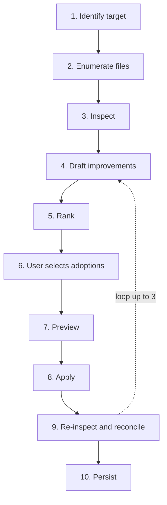

# smith

> smith is a craftsperson tool for Claude Code setups: it inspects files, drafts improvements, applies them after approval, and verifies the result.

**Status**: design-documentation stage. The plugin itself is not yet implemented; this repository holds the specification that the implementation at `agents-in-your-area/.claude/plugins/smith/` will follow.

## What smith does

- **Identity**: craftsperson. smith applies changes itself — it is not a consultant that only reports.
- **Loop**: Evaluate → Propose → Apply, in a single pipeline.
- **Two-layer model**:
  - **Feature** = user-visible capability, the entry point (e.g., "PR review flow").
  - **Component** = inspection unit: Prompt / Command / Agent / Skill / Hook / CLAUDE.md / Plugin.
- **Target scope**: inside `.claude/` of the aiya monorepo — plugins and project-level setup.
- **Out of scope**: MCP servers, statusline, output-style.
- **Defaults**: dry-run; disk writes require explicit user approval.
- **Dogfooded**: smith is run on aiya's own `.claude/` to refine itself.

## Usage

### Invocation

```
/smith [<scope>]
```

`<scope>` is an optional positional hint — a file path, directory path, or capability phrase. If omitted, smith hears the target from the user (max 2 rounds; exits on failure).

### Pipeline

Fixed 10-step order. Approval gates at step 6 (adoption) and step 7 (preview). Step 9 may loop back to step 4, capped at 3 iterations (1 for self-inspection).



1. **Identify target** — use `<scope>` if given; otherwise hear it.
2. **Enumerate constituent files** — list the files composing the target and their call relationships (command→agent, hook→tool, skill reference, etc.).
3. **Inspect** — `[auto]` pre-pass (deterministic mechanical checks) + 3-lens parallel inspection. Each finding is `OK` / `NG` / `OOS` with a comment.
4. **Draft improvements** — for each `NG`, produce proposal + rationale + expected effect + patch content.
5. **Rank** — order by expected effect alone. Severity is internalized; effort is ignored because AI applies.
6. **User selects adoptions** — all / subset / reject-all. Reject-all persists findings and exits.
7. **Preview** — synthesize patches from adopted items, show diff, final confirmation.
8. **Apply** — write in dependency order (foundation → dependents); re-verify pre-image before each write; halt on failure.
9. **Re-inspect and reconcile** — re-run inspection on touched files, compare expected vs actual effect. If `unmet` or `regressed` remain, loop to step 4.
10. **Persist** — write findings, decisions, and reconcile history to `.claude/.smith.local.md`.

Steps 3 and 4 are one inspector invocation per file × lens: the inspector emits the verdict and, when `NG`, the draft + `patch_content` in a single JSON payload. See [`docs/design.md`](./docs/design.md#finding-schema) for the schema.

### Exception flows

- **Target unidentifiable** (hearing fails after 2 rounds): report and exit. Never fabricate a target.
- **All proposals rejected**: persist records and exit.
- **Self-inspection** (target resolves under `agents-in-your-area/.claude/plugins/smith/`): extra confirmation before Apply; iteration cap drops from 3 to 1 to prevent prompt-mutation mid-loop.
- **Write error mid-apply**: halt, report partial state, direct the user to `git status`. No auto-rollback — git owns revert.
- **Loop cap hit**: report residual findings and exit. No completion claim while `NG` remain.

## Architecture

Hybrid plugin (Archetype C) at `agents-in-your-area/.claude/plugins/smith/`.

### Components

| Part | Model | Role | Pipeline steps |
|---|---|---|---|
| `/smith` command | inherit | Orchestrator: dialogue, approval gates, dependency sort, writes, persistence | 1, 2, 5 (dispatch evaluator), 6, 7, 8, 10 |
| `smith-inspector-conventions` agent | Opus | Applies `checklists.md` per component type. Parallel per file. | 3, 4, 9 |
| `smith-inspector-patterns` agent | Opus | Matches anti-patterns from `patterns.md`. Parallel per file. | 3, 4, 9 |
| `smith-inspector-architecture` agent | Opus | Whole-view: dependencies, roles, responsibilities, wiring. Single pass per Feature. | 3, 4, 9 |
| `smith-knowhow` skill | — | Progressive disclosure: SKILL.md (taxonomy + common FP + index + load heuristic) + `references/` (per-component checklists and pattern excerpts) | supports 3, 4, 9 |
| `scripts/smith-autocheck.sh` | — | `[auto]`-tagged mechanical checks; emits Finding schema | 3 |
| `scripts/smith-evaluate.sh` | — | Merge findings → convergence score → threshold filter → rank; reconcile predicted vs actual at step 9 | 5, 9 |
| `scripts/smith-state.sh` | — | `.smith.local.md` front-matter I/O | 10 |

### Key decisions

- **Inspectors = Opus.** smith writes files that affect production setups; false positives and missed issues both cost real remediation. Precedent: pr-review-toolkit uses Opus for its final code-reviewer agent for the same reason.
- **Inspector combines inspection + drafting + patch synthesis.** Same file, same checklist — splitting would double file reads and fragment reasoning (project rule: collapse overlapping modes).
- **Scoring / ranking / reconcile as a script, not an agent.** Once findings carry tags and `expected_effect` is numeric, every downstream step is deterministic. A script is faster, cheaper, reproducible, and removes agent-bias risk.
- **Three parallel inspector lenses.** Independent judgments produce a convergence signal: findings caught by multiple lenses get higher confidence; single-lens findings are filtered out by the threshold.
- **Architecture lens is singleton per Feature.** Its job is to see the whole (dependencies, responsibilities, wiring). Splitting by file would break its function; per-file parallelism only helps where judgments are meaningfully independent.
- **`/smith` model = `inherit`.** Inspectors emit full `patch_content`, so `/smith` only orchestrates — dialogue, approval gates, dependency sort, Write/Edit, persistence. Assumes Sonnet-or-better caller; under Haiku, pre-image verification quality may degrade.
- **No auto-rollback on write failure.** Silent reversal would hide the failure and violate the "ban false promises" principle. git owns revert; smith halts and reports.

### `smith-knowhow` layout

```
smith-knowhow/
├── SKILL.md                    # taxonomy + common false-positive list + index + load heuristic
└── references/
    ├── prompt.md
    ├── command.md
    ├── agent.md
    ├── skill.md
    ├── hook.md
    ├── claude-md.md
    ├── plugin.md
    └── patterns.md             # anti-pattern excerpts used across components
```

One file per component type, mirroring the sections of [`docs/checklists.md`](./docs/checklists.md); `patterns.md` holds anti-pattern excerpts that apply across components. `references/` stays one level deep.

The `references/` files are **derived from** `docs/checklists.md` and `docs/patterns.md`, not copies of the whole `docs/` set. `docs/*.md` remain the source of truth and evolve independently; `smith-knowhow/` is populated from them during implementation (`tasks.md` §Step 3).

## References

- [`docs/design.md`](./docs/design.md) — internal data contracts: Finding schema, `finding_type` naming, `[auto]` pre-pass, `OOS` rule, `patch_content` format, data transport, convergence score, ranking, dependency ordering, state file schema, `allowed-tools`.
- Knowhow consulted by smith at runtime:
  - [`docs/concepts.md`](./docs/concepts.md) — three-layer model, plugin taxonomy.
  - [`docs/components.md`](./docs/components.md) — per-component design recipes.
  - [`docs/patterns.md`](./docs/patterns.md) — anti-patterns.
  - [`docs/case-studies.md`](./docs/case-studies.md) — seven official plugins as traceable source.
  - [`docs/checklists.md`](./docs/checklists.md) — per-component quality checklists.
  - [`docs/taxonomy.md`](./docs/taxonomy.md) — 107-item knowhow index across five domains.
- [`tasks.md`](./tasks.md) — original intent, active cross-cutting tasks, pivot history.

