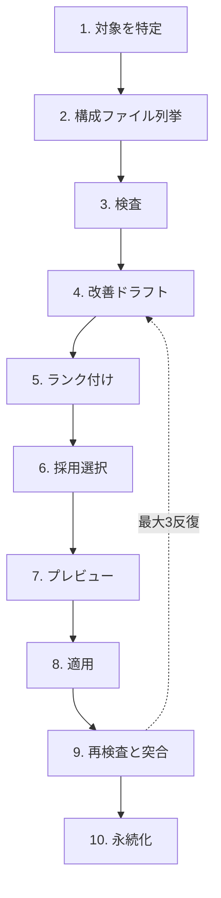

# smith

> smith は Claude Code セットアップ向けの職人ツール。ファイルを検査し、改善をドラフトし、承認後に適用し、結果を検証する。

**ステータス**: 設計ドキュメント段階。プラグイン実装はまだ着手していない。本リポジトリは `agents-in-your-area/.claude/plugins/smith/` に置かれる実装が従う仕様を保持する。

## smith の役割

- **アイデンティティ**: 職人。smith は変更を自分で適用する — 報告だけのコンサルタントではない。
- **ループ**: 評価 → 提案 → 適用 を 1 本のパイプラインで回す。
- **二層モデル**:
  - **フィーチャー** = 利用者から見える機能。エントリポイント（例：「PR レビューフロー」）。
  - **コンポーネント** = 検査単位：Prompt / Command / Agent / Skill / Hook / CLAUDE.md / Plugin。
- **対象スコープ**: aiya モノレポ（smith のデプロイ先）の `.claude/` 配下 — プラグインおよびプロジェクトレベルのセットアップ。
- **対象外**: MCP サーバー、statusline、output-style。
- **既定動作**: dry-run。ディスクへの書き込みは明示的なユーザー承認が必要。
- **ドッグフーディング**: smith は aiya 自身の `.claude/` に対して実行され、自己改善する。

## 使い方

```
/smith [<scope>]
```

`<scope>` はオプションの位置引数 — ファイルパス、ディレクトリパス、または機能を表す語句。省略すると smith はユーザーに対象を尋ねる（最大 2 ラウンド、特定できなければ終了）。

例：

```
/smith commands/pr-review.md
```

## パイプライン

固定 10 ステップ。承認ゲートはステップ 6（採用選択）とステップ 7（プレビュー）。ステップ 9 はステップ 4 にループバック可能。最大 3 反復（自己検査時は 1 反復）。



1. **対象を特定** — `<scope>` が与えられていればそれを使う。なければユーザーに尋ねる。
2. **構成ファイル列挙** — 対象を構成するファイルとその呼び出し関係（command→agent、hook→tool、skill 参照など）を列挙する。
3. **検査** — `[auto]` 前段パス（決定論的な機械的チェック）+ 3 レンズ並列検査。各検出項目は `OK` / `NG` / `OOS` とコメントを持つ。
4. **改善ドラフト** — 各 `NG` について、提案 + 根拠 + 期待効果 + パッチ内容 を出す。
5. **ランク付け** — 期待効果のみで順序付け。重要度は内部化されており、コストは AI が適用するため無視。
6. **採用選択** — 全採用 / 部分採用 / 全却下 から選ぶ。全却下なら検出を保存して終了。
7. **プレビュー** — 採用された項目からパッチを合成し、差分を表示し、最終確認を取る。
8. **適用** — 依存順（基盤 → 依存先）で書き込み。各書き込み直前に pre-image を再検証し、失敗時は停止。
9. **再検査と突合** — 触ったファイルを再検査し、期待効果と実結果を突合する。`unmet` または `regressed` が残ればステップ 4 に戻る。
10. **永続化** — 検出、決定、突合履歴を `.claude/.smith.local.md` に書き出す。

ステップ 3 と 4 は「ファイル × レンズ」あたり 1 回のインスペクター呼び出しで完結する。インスペクターは判定を出し、`NG` の場合はドラフト + `patch_content` も同じ JSON ペイロードに含めて返す。スキーマ詳細は [`docs/design.md`](./docs/design.md#finding-schema) 参照。

### 例外フロー

- **対象が特定できない**（2 ラウンド尋ねても出てこない）: 報告して終了。対象を捏造しない。
- **すべての提案が却下された**: 記録を保存して終了。
- **自己検査**（対象が `agents-in-your-area/.claude/plugins/smith/` 配下に解決される場合）: 適用前に追加確認。反復上限を 3 から 1 に下げ、ループ中に smith 自身のプロンプトが書き換わらないようにする。
- **適用中の書き込みエラー**: 停止し、部分状態を報告し、ユーザーに `git status` を案内する。自動ロールバックはしない — リバートは git の責務。
- **反復上限到達**: 残った検出を報告して終了。`NG` が残る間は完了宣言しない。

## アーキテクチャ

ハイブリッドプラグイン（[Archetype C](./docs/concepts.md#archetype-c-hybrid-toolkit)）として `agents-in-your-area/.claude/plugins/smith/` に配置。

### 構成要素

| Part | Model | 役割 | パイプラインステップ |
|---|---|---|---|
| `/smith` command | inherit | オーケストレーター：対話、承認ゲート、依存ソート、書き込み、永続化 | 1, 2, 5（評価器ディスパッチ）, 6, 7, 8, 10 |
| `smith-inspector-conventions` agent | Opus | コンポーネント種別ごとに `checklists.md` を適用。ファイルごとに並列。 | 3, 4, 9 |
| `smith-inspector-patterns` agent | Opus | `patterns.md` のアンチパターンと照合。ファイルごとに並列。 | 3, 4, 9 |
| `smith-inspector-architecture` agent | Opus | 全体ビュー：依存関係、役割、責務、配線。フィーチャー単位で 1 回。 | 3, 4, 9 |
| `smith-knowhow` skill | — | プログレッシブディスクロージャー：SKILL.md（taxonomy + 共通 FP + index + ロード方針）+ `references/`（コンポーネント別チェックリスト + パターン抜粋） | 3, 4, 9 を支援 |
| `scripts/smith-autocheck.sh` | — | `[auto]` タグ付き機械的チェック。Finding スキーマで出力。 | 3 |
| `scripts/smith-evaluate.sh` | — | 検出マージ → 収束スコア → 閾値フィルタ → ランク付け。ステップ 9 では予測と実結果を突合。 | 5, 9 |
| `scripts/smith-state.sh` | — | `.smith.local.md` のフロントマター I/O。 | 10 |

### 主要な設計判断

- **インスペクターは Opus**。smith は本番セットアップに影響するファイルを書く。誤検出も見落としも実コストになる。pr-review-toolkit が最終 code-reviewer エージェントに Opus を選んでいる前例と同じ理由（最重要判断には最高の推論モデル）。
- **インスペクターは検査 + ドラフト + パッチ合成を 1 回でこなす**。同じファイル、同じチェックリスト — 分割すれば読み込みが倍になり推論も分断される（プロジェクト規約：重なるモードは畳む）。
- **スコアリング / ランキング / 突合はエージェントではなくスクリプト**。検出にタグが付き `expected_effect` が確定的になれば、以降はすべて決定論的。スクリプトの方が速く安く再現可能で、エージェント由来のバイアスもない。
- **3 レンズの並列インスペクター**。独立判断は収束シグナルを生む。複数レンズに引っかかった検出は信頼度が上がり、単一レンズの検出は閾値で落ちる。
- **アーキテクチャレンズはフィーチャー単位で 1 回だけ**。役割は全体（依存、責務、配線）を見ること。ファイル単位に分割すると機能を失う。ファイル並列が効くのは判断が独立している場合だけ。
- **`/smith` のモデルは `inherit`**。インスペクターが完全な `patch_content` を返すので、`/smith` はオーケストレーション（対話、承認ゲート、依存ソート、Write/Edit、永続化）のみ。Sonnet 以上の呼び出し元を前提とする。Haiku 下では pre-image 検証品質が低下しうる。
- **書き込み失敗時の自動ロールバックはしない**。サイレントな巻き戻しは失敗を隠し、「偽りの完了宣言を禁ずる」原則に反する。リバートは git、smith は停止して報告。

### `smith-knowhow` レイアウト

```
smith-knowhow/
├── SKILL.md                    # taxonomy + 共通誤検出リスト + index + ロード方針
└── references/
    ├── prompt.md
    ├── command.md
    ├── agent.md
    ├── skill.md
    ├── hook.md
    ├── claude-md.md
    ├── plugin.md
    └── patterns.md             # コンポーネント横断のアンチパターン抜粋
```

[`docs/checklists.md`](./docs/checklists.md) のセクション構成と対応する形で、コンポーネント種別ごとに 1 ファイル。`patterns.md` はコンポーネント横断のアンチパターン抜粋。`references/` は 1 階層に留める。

`references/` 配下のファイルは `docs/checklists.md` および `docs/patterns.md` から**派生**したものであり、`docs/` 全体のラッパーではない。`docs/*.md` が source of truth であり独立に進化する。`smith-knowhow/` は実装時にそこから生成される（`tasks.md` §Step 3）。

## 参照

- [`docs/design.md`](./docs/design.md) — 内部データ契約：Finding スキーマ、`finding_type` 命名、`[auto]` 前段パス、`OOS` ルール、`patch_content` 形式、データ転送、収束スコア、ランキング、依存順序、状態ファイルスキーマ、`allowed-tools`。
- smith が実行時に参照する knowhow:
  - [`docs/concepts.md`](./docs/concepts.md) — 三層モデル、プラグイン分類。
  - [`docs/components.md`](./docs/components.md) — コンポーネント別の設計レシピ。
  - [`docs/patterns.md`](./docs/patterns.md) — アンチパターン。
  - [`docs/case-studies.md`](./docs/case-studies.md) — 公式 7 プラグインの事例（trace 元）。
  - [`docs/checklists.md`](./docs/checklists.md) — コンポーネント別の品質チェックリスト。
  - [`docs/taxonomy.md`](./docs/taxonomy.md) — 5 ドメインに整理された 107 項目のノウハウ索引。
- [`tasks.md`](./tasks.md) — 当初意図、横断的アクティブタスク、Pivot 履歴。
