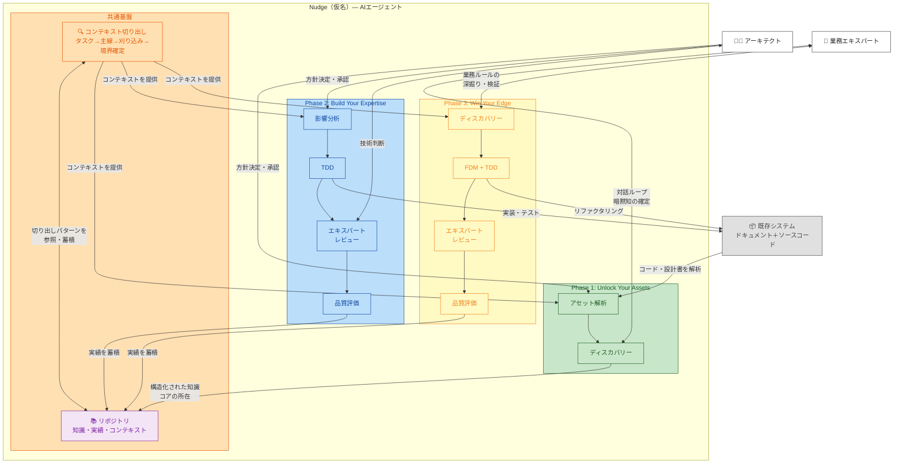

# Get AI-Ready. We Nudge You.

*ドラフト v0.1 — 2026-03-28*

エンタープライズシステムを、事業の足枷から競争力の源泉へ。

## エンタープライズシステムの現実

### 調査結果

- 投資の硬直化 — IT予算の80%が保守・運用に消え、攻めの投資に回せない[^1]。モダナイゼーション市場は年10%成長で2030年に2.1兆円規模と予測されるが、実行は追いついていない[^2]
- レガシーの残存 — 2025年時点で大企業・中堅企業の約8割がレガシーシステムを保有[^2]。ユーザー企業の61%、大企業に限ると74%でレガシーが残存[^3]
- 市場対応速度の低下 — レガシーシステムが足枷となり、生成AI等の最新技術の連携・組み込みがスムーズに進められない[^3]
- 人材の悪循環 — 2030年までに最大約79万人のIT人材が不足[^1]。IT人材の需要に対しベンダー企業の供給は充足率66%に留まり、上流人材が特に不足[^3]
- AI開発ツールの限界 — AIアシスタント普及後、コードの重複ブロックが約8倍に増加し、リファクタリングは24%→10%に低下[^5]。既存ツールはモダンアーキテクチャ前提で、エンタープライズシステムには機能しない[^4]

### 仮説

- コンテキストの不在 — ベテランは作業に必要なコンテキスト（関連するテーブル群、ビジネスルール、処理の組み合わせ）を無意識に切り出して判断している。大規模システムでも全体を把握しているわけではなく、タスクに必要な範囲だけを刈り込んで見ている。この「何を見て、何を見なくていいか」の判断力がどのドキュメントにも明示されておらず、属人性の正体になっている
- 暗黙知の散在 — 業務ルールがコード・SQL・設計書・テストデータに散らばり、明文化されていない
- 判断基準の不在 — ルールはあっても適用判断がない。レビュー品質がレビューア依存
- 経験の断絶 — PJ終了で知見が散逸。同じ失敗が繰り返される
- 構造の不透明さ — 成果物間の依存が追えず、変更影響が見通せない
- AI開発ツールの本質的限界 — 既存のAIツールはコードをたどることはできるが、「ここから先は見なくていい」という刈り込みができない。大規模システムでは関連が芋づる式に広がり発散する。問題はAIの能力不足ではなく、コンテキストを切り出すワークフローが実装されていないこと
- エンタープライズシステムの多くが、AI駆動開発の恩恵から取り残されている

## あるべき姿

- 技術的負債が整理され、保守リソースを攻めの投資に回せている
- 技術とビジネス、両方のエキスパートの判断力がチームに共有されている
- コアな業務ルールがコードで守られ、業務変化にシステムが即座に追従できている
- 事業成長を自分たちの意思で加速できている

## ソリューション：Nudge（仮名）

### 全体像

**Nudge（仮名）** は、お客様の技術スタックに合わせて動くAIエージェントです。特定のフレームワークに依存せず、お客様の既存システムをそのまま受け入れた上で、3つのフェーズで競争優位の獲得までを一貫して支援します。

**3つのフェーズ：**

1. **Unlock Your Assets** — 既存資産を解析し、AI-Readyに変換する
2. **Build Your Expertise** — AIエージェントと共にエキスパートレベルの開発力を築く
3. **Win Your Edge** — コアな業務ルールをコードで守り、競争優位を手に入れる

各フェーズは単独でも価値があり、同時に次のフェーズの土台になる。

### ソリューション構成図

### Nudge（仮名）の構成

Nudge（仮名）はAIエージェントです。ツールではなく、プロジェクトに参加するメンバーとして動きます。リーダーではなく優秀なメンバー。GitHubのissueとPRを接点に、人間が要件を伝えるとIssue提案→承認→計画・実装→テスト・レビュー→承認・マージと進みます。

Nudge（仮名）を構成する3つの要素：

**ワークフロー** — フェーズごとに異なるワークフローが、Nudge（仮名）の自律的な判断と行動を駆動します。全てのワークフローは**タスクから必要なコンテキストを切り出す**ことから始まります。エントリーポイントの特定、処理の主線のたどり、刈り込みルールによる境界の判断。ベテランが無意識にやっているこの手順をワークフローとして実装することで、AIが大規模システムでも適切な範囲に集中して作業できます。その上で、Phase 1ではアセット解析とディスカバリー。Phase 2では影響分析→TDD→エキスパートレビュー→品質評価。Phase 3ではディスカバリー→FDM+TDD→エキスパートレビュー→品質評価。

**知識** — お客様の技術スタック、開発標準、品質基準。Phase 1で既存システムから抽出・構造化され、リポジトリに蓄積されます。知識はフラットではなく**コンテキスト単位で構造化**されます。「この機能に関係するのはこのテーブル群とこのビジネスルール」という切り出し方自体が知識として蓄積され、次のタスクで再利用されます。刈り込みの判断基準（FW共通処理は支線、マスタテーブルは境界の外、等）もここに含まれます。

**実績** — PJごとの判断と結果の蓄積。Phase 2・3の日常業務を通じてリポジトリに記録され、知識とワークフローにフィードバックされます。「前回この変更でここまでが影響範囲だった」という実績が、次のコンテキスト切り出しの精度を上げます。PJを重ねるほどNudge（仮名）の判断力が強くなります。

**技術スタック非依存。** お客様が使っているフレームワーク、言語、データベースに合わせて動きます。特定のFWへの移行を前提としません。今のシステムのまま、AI駆動開発の恩恵を届けます。

## 3つのフェーズ：競争優位を手に入れるための積み上げ

3フェーズは蓄積の順番ではありません。**お客様が自分たちの意思で事業を加速できる状態に到達するための条件が積み上がる順番**です。

### Phase 1: Unlock Your Assets — 既存資産を解析し、AI-Readyに変換する

既存システムに眠る暗黙知と業務ルールを、AIが活用できる形に変換します。お客様のシステムがどのような技術スタックで構築されていても対応します。

Phase 1のワークフローは2つです。

**アセット解析** — ソースコード・ドキュメント・設定ファイルなど、お客様の既存資産を解析し、構造を把握します。動いているコードは検証済みの事実です。設計書は不完全でテストされていません。コードから「今どう作っているか」を逆算する方が確実です。解析は人が操作し、AIが各ステップを支援します。

**ディスカバリー** — アセット解析で検出された不整合（コードと設計書の矛盾、規約と実態の乖離、暗黙の前提）を起点に、アーキテクトや業務エキスパートとの対話ループで知識を確定します。この過程で「ここが独自の業務判断ルール、ここは定型処理」というコアの所在が浮かび上がります。これがPhase 3の土台になります。

**2つの解析モード：**

- **汎用解析** — 技術スタックに応じた標準的な解析。ソースコード・テーブル定義・設定ファイルなど、構造が規定されている成果物向け
- **PJ固有解析** — PJごとにアーキテクトが設定。フォーマットがPJ依存の成果物向け（設計書、要件定義書等）

**出力（リポジトリに蓄積）：**

- 知識（JSON）— 成果物から抽出・検証・確定した情報。ワークフローの判断基準になる
- マッピング（JSON）— 3層のメタ構造
  - ① 知識 ↔ 元成果物（トレーサビリティ）
  - ② 成果物間（テーブル単位の依存関係）。カラム単位はPhase 2で動的解析
  - ③ 知識間（規約↔実装パターン、バッチ入出力依存チェーン等）
- 不整合リスト — ディスカバリーのトリガー
- 開発ガイド（現行とAI-Ready）

**対象となる成果物：**

| # | 成果物 | 扱う内容 |
|---|--------|---------|
| 1 | 要件定義書 | スコープ、目的、目標値、業務フロー、業務ルール、変更要求仕様 |
| 2 | 設計書（外部設計） | 機能設計、画面設計、バッチ外部仕様、テーブル論理設計、IF定義、メッセージ定義 |
| 3 | 設計書（内部設計） | クラス設計、SQL設計、テーブル物理設計、処理フロー |
| 4 | 開発ガイド | 方式設計＋開発標準＋手順を統合。PJにおける「どう作るか」の唯一の基準 |
| 5 | ソースコード | アプリケーションコード、テストコード、設定ファイル |
| 6 | テスト仕様書/報告書 | テストケース、テスト結果、性能テスト結果 |
| 7 | テストデータ | 共通テストデータ、テストケース用データ |
| 8 | 不具合票 | 障害票、設計修正指示 |
| 9 | チェックリスト/レビュー結果 | レビューチェックリスト、レビュー指摘事項 |

**企業が得られるもの：**
- 構造化された知識と成果物間のマッピング
- 開発ガイド（現行とAI-Ready）
- 技術的負債の可視化
- コアの所在の特定

**誰にとっての価値：**
- アーキテクト → 暗黙知を明示化し、コアの所在を特定できる
- アプリエンジニア → 構造化された業務ルールへ即座にアクセスできる
- PJマネージャー → タスクの依存関係が可視化され、リソース配置を最適化できる
- 経営層・IT投資判断者 → 技術的負債が定量化され、データに基づく投資判断ができる

### Phase 2: Build Your Expertise — AIエージェントと共にエキスパートレベルの開発力を築く

Nudge（仮名）がAIエージェントとしてPJに参加し、経験の浅いメンバーもベテランの判断基準で開発できるようになります。保守運用コストの削減と戦略的投資へのシフトを実現します。

Phase 2のワークフローは4つです。

**影響分析** — 変更要件に対して、リポジトリの知識・マッピングを参照し、影響範囲を特定します。どこを変えるとどこに波及するかを、コードに触れる前に把握します。

**TDD** — 影響分析の結果を踏まえ、テスト駆動開発で実装を進めます。テストを先に書き、実装し、テストが通ることを確認する。このサイクルをNudge（仮名）が支援します。

**エキスパートレビュー** — 実装結果をベテランの視点でレビューします。設計の妥当性、トレードオフの判断、見落としの検出。アーキテクトとNudge（仮名）が技術判断を共有します。

**品質評価** — 品質基準に照らして合否を判定します。レビュー結果とテスト結果を総合的に評価し、判断と結果をissue・PRに記録します。この記録がリポジトリに実績として蓄積されます。

**Buildが確立するのは、Winの前提条件です。** 自動テストの整備と、コアとそれ以外の区分の明確化。この2つがPhase 3のリファクタリングを安全に進めるための土台になります。

**企業が得られるもの：**
- 影響分析に基づく確実な変更管理
- TDDによる品質の底上げ
- エキスパートレビューの知見の共有
- 判断と結果のissue・PRへの記録（実績の蓄積）
- 自動テストの整備（Phase 3の安全網）

**誰にとっての価値：**
- アーキテクト → 日常の技術判断をNudge（仮名）が代行し、根本設計・トレードオフ判断に専念できる
- アプリエンジニア → TDDとエキスパートレビューにより、承認・業務判断・最終責任に注力できる
- PJマネージャー → 新メンバーを即戦力化し、安定した開発体制を維持できる
- 業務部門 → 要件の実現工数見積が素早く得られ、迅速な優先度判断ができる

### Phase 3: Win Your Edge — コアな業務ルールをコードで守り、競争優位を手に入れる

Phase 1・2で技術エキスパートの判断力はNudge（仮名）を通じてチームに共有されました。しかし「事業の足枷から競争力の源泉へ」には、もう一つの柱が必要です。**業務エキスパートの判断力** — お客様のビジネスにとって競争力の源泉となっている業務ルール — をシステムの構造的な力にすることです。

業務は技術より変化が速く、今後ますます加速します。コアな業務ルールが属人的である限り、システムは業務変化に追従できず、事業成長はシステムで止まります。

Phase 3のワークフローは4つです。Phase 2と後半が共通で、前半が異なります。

**ディスカバリー** — Phase 1で特定されたコアの中身を、業務エキスパートとの対話で深掘りします。「この取引は受けていいか」「この例外ケースはどう扱うか」「この顧客にはどの料率を適用するか」。こうした判断ルールをFDMの型定義と対話しながら確定します。

**FDM + TDD** — 関数型ドメインモデリング（FDM）でコアな業務ルールを型と純粋関数に変換し、TDDでリファクタリングを進めます。既存コードの関数を基本単位とする構造との相性が良く、大きなパラダイム転換ではありません。Phase 2で自動テストが整備されているため、安全にリファクタリングできます。SQLやDBアクセスはI/Oとしてそのまま残ります。

**エキスパートレビュー** — リファクタリング結果をレビューします。Phase 2と同じワークフローです。

**品質評価** — 品質基準に照らして評価し、実績をリポジトリに蓄積します。Phase 2と同じワークフローです。

**FDMがコードで表現するもの：**

- **状態遷移** — 「未承認の注文」と「承認済みの注文」を別の型にする。不正な遷移をコンパイル時に防止
- **判定・計算ロジック** — 与信判定や割引適用を副作用のない純粋関数として分離。業務部門と「このケースはどうなるか」をコードを見ながら会話できる
- **制約** — 数量は1以上、通貨の混在禁止など、不正な値をそもそも作れなくする
- **パターン網羅** — 割引の種類やエラーの種類をsealed型で定義。新パターン追加時の対応漏れがコンパイルエラーで検出される

**対象はコアだけ：** FDMの対象は、お客様のビジネスにとって競争力の源泉となっている業務判断ロジックに限定します。定型的なCRUD、一括集計バッチのSQL、マスタ管理などは対象外です。何がコアかはお客様ごとに異なり、Phase 1のディスカバリーで特定されます。

**なぜPhase 3でこれが可能になるのか：**

1. Phase 1のディスカバリーでコアの所在が特定されている
2. Phase 2のTDDで自動テストが整備されている（リファクタリングの安全網）
3. Phase 2の実績がリポジトリに蓄積されている（Nudge（仮名）がリファクタリングを支援できる）

**企業が得られるもの：**
- コアな業務ルールの明示化と、業務エキスパートの属人性からの解放
- 業務ルール変更時の影響範囲のコンパイラによる特定
- 設計書・テストコードの削減
- 業務変化への追従がシステムの構造的な能力になる

**誰にとっての価値：**
- 業務エキスパート → 自身の判断ルールがコードで表現され、暗黙知が組織資産になる
- アーキテクト → コアな業務ルールの変更影響がコンパイラで特定でき、確実な判断を下せる
- アプリエンジニア → 型がガードレールになり、業務知識が浅くても安全にコアを修正できる
- PJマネージャー → 業務変更の影響範囲と工数が従来より正確に見積もれる
- 経営層・IT投資判断者 → コアな業務ルールが組織資産としてコードに残り、人の入れ替わりに左右されない競争力の基盤を持てる

## 実現の仕組み

### なぜ汎用AIでは不十分なのか

汎用AIはコードをたどることができます。しかし大規模エンタープライズシステムでは、たどるだけでは全てがつながり発散します。共通ライブラリ、フレームワーク、設定ファイル...芋づる式に広がって「全部関係ある」になってしまいます。

ベテランが大規模システムで的確に作業できるのは、「ここから先は見なくていい」という刈り込みを無意識にやっているからです。FW共通処理は支線、マスタテーブルは変わらない前提、他システムとのIFは境界だけ見る。こうした判断パターンでコンテキストを絞り込み、必要な範囲だけに集中しています。

既存のAI開発ツールにこのワークフローが実装されていないことが、大規模エンタープライズシステムで機能しない根本原因です。AIの能力不足ではなく、適切なコンテキストを切り出す手順が組まれていない。

Nudge（仮名）は、このコンテキスト切り出しをワークフローとして実装します。タスクを起点にエントリーポイントを特定し、主線をたどり、刈り込みルールで境界を判断し、コンテキストを確定する。その上で、コンテキスト内の作業をAIが実行します。

### 構造的競争優位

知識は公開すれば真似できます。実績はデータがあれば蓄積できます。しかしワークフロー — コンテキストの切り出し方、刈り込みの判断基準、フェーズごとの作業手順 — は現場経験から設計しないと作れません。**最も真似しにくいのはワークフロー**です。

Phase 2とPhase 3のワークフローは後半が共通（エキスパートレビュー→品質評価）で、前半が異なります（影響分析→TDD vs ディスカバリー→FDM+TDD）。この共通構造により、Phase 2で蓄積した品質保証の実績とコンテキストの切り出しパターンがPhase 3でそのまま活きます。

## 登場人物と役割

| 登場人物 | 役割 |
|---|---|
| Nudge（仮名） | AIエージェント。ワークフロー・知識・実績で構成。3フェーズを一貫して支援 |
| アーキテクト | 方針決定・承認。PJ固有解析の設定。コアの特定。技術判断の最終責任 |
| 業務エキスパート | コアな業務ルールの源泉。ディスカバリーで判断ルールを確定・検証 |
| 要件定義者/設計者 | 要求分析、機能設計、テストケース設計 |
| アプリエンジニア | Nudge（仮名）との日常的な協働。承認・業務判断・最終責任は人間 |
| データモデラー | データ定義・DB設計 |
| PJマネージャー | 計画・進捗・リソース配分の判断 |
| 経営層・IT投資判断者 | 投資判断・予算承認。可視化データに基づく意思決定 |
| 業務部門 | 業務要件の提示・受入判断 |

---

## 今後の展開

パイロットPJで実測し、段階的に展開。仮説段階で過剰な数字は置かない。

---

[^1]: 経済産業省「DXレポート ~ITシステム『2025年の崖』克服とDXの本格的な展開~」（2018年9月）及び「IT人材需給に関する調査」（2019年3月） — IT関連予算の80%が保守・運用に費やされ、2030年までに最大約79万人のIT人材が不足と予測。URL: https://www.meti.go.jp/policy/it_policy/dx/dx.html

[^2]: IDC Japan「2026年 国内ITモダナイゼーション市場動向」（2026年2月） — 2025年の国内ITモダナイゼーション市場は1兆3044億円（前年比10.1%増）。2030年には2兆1234億円に成長と予測（CAGR 10.2%）。大企業・中堅企業の約8割が2025年時点でレガシーシステムを保有。URL: https://it.impress.co.jp/articles/-/28987

[^3]: 経済産業省「レガシーシステムモダン化委員会 総括レポート」（2025年5月） — ユーザー企業の61%がレガシーシステムを保有。大企業では74%。IT人材需給の充足率は66%に留まり、上流人材が特に不足。レガシーシステムが生成AI等の最新技術導入の足枷に。URL: https://www.meti.go.jp/press/2025/05/20250528003/20250528003.html

[^4]: Chen, M., et al. "Evaluating Large Language Models Trained on Code" (2021) — Codex（GitHub Copilotの基盤モデル）の学習データはGitHub上のオープンソースコードに偏重。モダンな言語・フレームワーク中心で、エンタープライズ固有フレームワークのカバレッジは限定的。URL: https://arxiv.org/abs/2107.03374

[^5]: GitClear "AI Copilot Code Quality Research" (2025) — 211百万行のコード変更データを分析。AIアシスタント普及後、コードの重複ブロックが前年比約8倍に増加。リファクタリング（moved lines）は2021年の24.1%から2024年の9.5%に低下。copy/pastedラインがmovedラインを史上初めて上回った。URL: https://www.gitclear.com/ai_assistant_code_quality_2025_research
